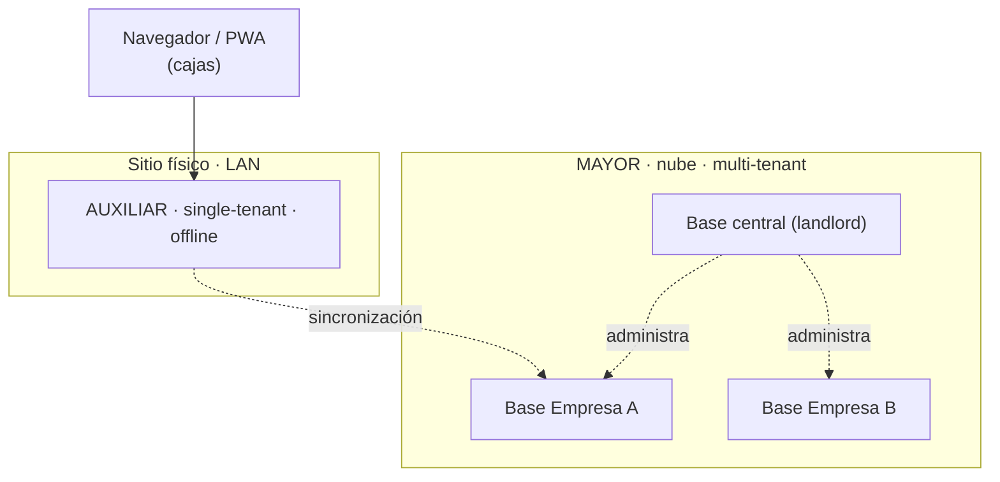
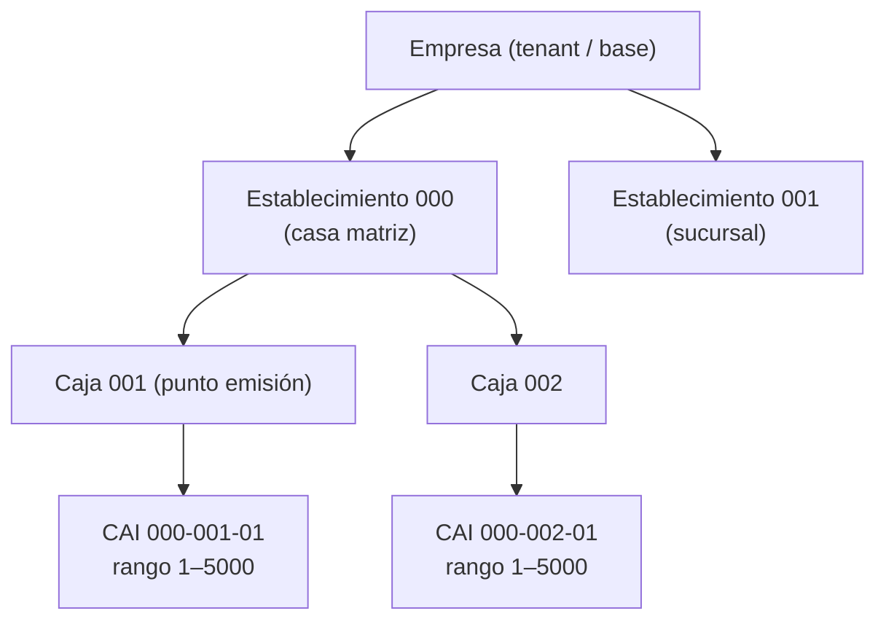
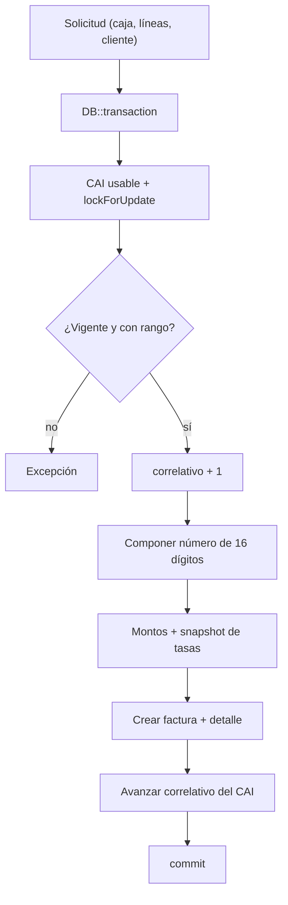

# Plan de implementación — Facturación distribuida multi-tenant

> **Versión 5** — SaaS de facturación multi-empresa con cumplimiento SAR Honduras. Mayor central en `factunet.io`, Auxiliares por sitio.
>
> **Última actualización:** 2026-06-16

## Cambios respecto a la v4

- **Etapa 2 completada y verificada** — todos los pasos 2.1–2.6 están construidos e integrados (ver detalle abajo).
- **Extras implementados fuera del plan original** (documentados acá para evitar trabajo duplicado):
  - PDF de factura (DomPDF, header 3 columnas, sección cliente en 3 filas, colores de marca).
  - Reportes PDF: ISV, Anuladas, Libro de Ventas (con firma).
  - `GestionReportes` Livewire + `ReportesController` para descarga.
  - `ConfiguracionEmpresa` — logo, colores de marca, RBAC `empresa.editar`.
  - RBAC (Spatie/laravel-permission) con roles y permisos por tenant.
  - `AuditoriaLog` — registro de actividad (`activity_log`).
  - `PosFactura` — interfaz de punto de venta rápida.
- **Foco actual: Etapa 3** — Motor de sincronización Mayor ↔ Auxiliar.
- **Pendientes de polish** (diferidos para no bloquear Etapa 3):
  - Ajustes finales de UI/PDF (bordes, proporciones, etc.).
  - `instance.uuid` no configurado en `.env` (necesario antes de producción).

## Convención de estado

- ✅ **Implementado** — construido y verificado.
- 🔧 **En curso / pendiente** — en implementación o por hacer dentro de una etapa activa.
- 🗓️ **Planificado** — etapa futura.

## Estado general

| Etapa | Enfoque | Estado |
|-------|---------|--------|
| 1 | Cimientos del Mayor + fundación multi-tenant | ✅ Completa |
| 2 | Módulo de facturación (tenant-scoped) | ✅ Completa |
| 3 | Motor de sincronización | 🔧 Siguiente |
| 4 | Despliegue del Auxiliar (Docker) | 🗓️ |
| 5 | Capa PWA del frontend | 🗓️ |
| 6 | Producción y operaciones | 🗓️ |

**Stack:** Laravel 13 + Livewire 3 + Alpine.js + MariaDB (driver `mariadb`) + `stancl/tenancy` 3.10.
**Escala objetivo:** 10–50 empresas. **Cumplimiento:** Acuerdo 481-2017 SAR-DGT, Decreto 24-2014 (ISV).

---

## Modelo conceptual

Una sola plataforma (el Mayor) da servicio a varias empresas, cada una con sus datos aislados en su propia base. Cada empresa tiene establecimientos (sucursales) y cada establecimiento, cajas (puntos de emisión). Cada caja es una terminal con un único emisor.



Jerarquía fiscal dentro de cada empresa:



El número fiscal del SAR (16 dígitos, `NNN-NNN-NN-NNNNNNNN`): establecimiento (3) + punto de emisión (3) + tipo de documento (2) + correlativo (8).

---

## Decisiones de diseño clave

1. **Base de datos por empresa** (database-per-tenant, `stancl/tenancy`). Aislamiento físico de datos fiscales; el esquema del tenant es idéntico al del Auxiliar single-tenant.
2. **Código de establecimiento editable, default 000.** El SAR lo asigna y puede variar según la solicitud; no se hardcodea.
3. **Impuestos como tabla configurable.** Tasas editables, tipos extensibles. La tabla define las tasas *vigentes*; cada renglón de factura **congela** la tasa usada (integridad fiscal: cambiar una tasa no altera el histórico).
4. **Una caja = una terminal = un emisor.** `lockForUpdate()` sobre la fila del CAI es salvaguarda (doble-submit, reintentos de cola, caso institucional), no el mecanismo principal.
5. **Estado del CAI derivado** (VIGENTE/AGOTADO/VENCIDO), no almacenado, para evitar estado obsoleto.
6. **`correlativo_actual` = último emitido.** Un CAI nuevo arranca en `rango_inicial - 1`.
7. **Montos de factura genéricos en el encabezado + snapshot por renglón.** El desglose por tasa (15%, 18%) se arma agrupando el detalle; el encabezado no hardcodea columnas por tasa.
8. **Factura inmutable.** Número, código CAI y datos del cliente se guardan como snapshot; las facturas no se borran, solo se anulan.
9. **Defensa en capas contra duplicados.** `lockForUpdate()` previene la carrera; el índice `unique` sobre `numero_completo` es la red de seguridad.
10. **Lógica crítica en clases Action**, nunca en componentes Livewire ni controladores.
11. **UUID como identidad desde el origen** (idempotencia de sync); `synced_at`/`origin` ya implementados en todos los modelos tenant.

---

## Entornos

| Entorno | Ubicación | Rol | Pila | Estado |
|---------|-----------|-----|------|--------|
| **Mayor-dev** | `factunet.io` (Vultr, 1 GB, Ubuntu 24.04) | Desarrollo / staging | Apache + PHP-FPM 8.4 + MariaDB | ✅ |
| **Mayor-prod** | Servidor separado | Producción | Clon de dev, sin debug, respaldos reforzados | 🗓️ |
| **Auxiliar** | Mini-PC por sitio | Emisión local offline | Docker (Nginx + PHP-FPM + MariaDB + Redis) | 🗓️ |

> Regla: se desarrolla en Mayor-dev; los Auxiliares solo sincronizan con Mayor-prod; nunca se desarrolla sobre la instancia que emite facturas reales.

---

## Etapa 1 — Cimientos + fundación multi-tenant ✅

Completa y verificada.

- **1.1** ✅ Laravel 13 + Livewire 3. `INSTANCE_MODE`, `config/instance.php`, middleware `instance.mode`. Drivers `database` para cola/caché/sesión.
- **1.2** ✅ `/usr/local/bin/backup-mayor.sh` (mysqldump + gzip, retención 14 días, cron 02:00). Restauración verificada.
- **1.3** ✅ `stancl/tenancy` 3.10. Modelo `Tenant` database-per-tenant, manager `mariadb`, provisión síncrona en dev.
- **1.4** ✅ Comando `empresa:crear` (crea tenant → provisiona base → migra esquema → siembra admin + casa matriz 000 + caja 001 + impuestos default).

---

## Etapa 2 — Módulo de facturación ✅

Todo vive en el contexto del tenant (`database/migrations/tenant/`).

- **2.1** ✅ Tablas `establecimientos`, `puntos_emision`, `impuestos`; modelos con relaciones; trait `GeneratesUuid`. Casa matriz 000, caja 001, impuestos (Exento 0%, ISV 15% default, ISV 18%) sembrados en `empresa:crear`.
- **2.2** ✅ Tabla `cai_autorizaciones`; modelo `CaiAutorizacion` con estado derivado, cantidades, alertas `por_agotarse` (≥80%) y `por_vencer` (≤30 días), scopes `usable`/`delPunto`.
- **2.3** ✅ Tablas `facturas` + `detalle_facturas`; `EmisorFactura` (transacción + `lockForUpdate` + correlativo + número 16 dígitos + snapshot tasas); `AnulaFactura` (anulación auditable con `motivo_anulacion`/`anulada_por`/`anulada_at`); comando `factura:prueba` para test de concurrencia.
- **2.4** ✅ `Rules\Rtn`; catálogos `clientes` y `productos` con tablas, modelos y componentes Livewire; validación de montos en `EmisorFactura`.
- **2.5** ✅ Migración `add_sync_fields_to_tenant_tables`; trait `TracksSyncOrigin` (setea `origin` desde `config('instance.uuid')` al crear) aplicado a todos los modelos tenant. `synced_at` disponible en todas las tablas transaccionales y maestras.
- **2.6** ✅ Componentes Livewire: `FormFactura`, `PosFactura`, `ListadoFacturas`, `GestionCai`, `GestionCajas`, `GestionEstablecimientos`, `GestionClientes`, `GestionProductos`, `GestionUsuarios`, `GestionRoles`, `AuditoriaLog`, `Dashboard`, `CajaSelector`. PDF factura + 3 reportes PDF. RBAC Spatie + `ConfiguracionEmpresa`.

### Flujo de emisión (implementado en `EmisorFactura`)



---

## Etapa 3 — Motor de sincronización 🔧

El Auxiliar (single-tenant) sincroniza con la base de *su* empresa en el Mayor. Regla de oro: **idempotencia** (vía UUID).

**Orden de implementación:**

- **3.0 Tablas centrales de sync** — migración en landlord:
  - `instances`: UUID, tipo (mayor/auxiliar), tenant_id, establecimiento_id, nombre, último contacto.
  - `instance_tokens`: token (hash), instance_id, revocado, último uso.
  - Comando `instance:registrar` para dar de alta un Auxiliar y emitir su token.

- **3.1 Cola de sincronización** (lado Auxiliar) — tabla `sync_queue` en la base del Auxiliar; observer `SyncQueueObserver` que encola cambios cuando `INSTANCE_MODE=auxiliar`. Payload: `{tabla, uuid, accion, datos, creado_at}`.

- **3.2 Push** (`POST /api/sync/push`) — el Mayor valida el token de la tabla `instance_tokens`, inicializa el tenant correcto (`InitializeTenancyByRequestData`), procesa el lote de forma idempotente (`upsert` vía UUID), actualiza `synced_at`. Devuelve los UUIDs aceptados/rechazados.

- **3.3 Pull** (`POST /api/sync/pull`) — el Auxiliar pide cambios en datos maestros (clientes, productos, CAI nuevos, cajas, impuestos) desde una marca temporal (`updated_at > ?`). El Mayor filtra por tenant del token.

- **3.4 Conectividad y scheduler** — `ConnectivityChecker` (ping livewire al Mayor); scheduler en el Auxiliar: `sync:push` + `sync:pull` cada 5 min con backoff exponencial en fallos consecutivos.

- **3.5 Panel de monitoreo** — Livewire `MonitoreoInstancias` (solo en Mayor): lista de Auxiliares, último contacto, pendientes en cola, alertas de desconexión.

---

## Etapa 4 — Despliegue del Auxiliar (Docker) 🗓️

- **4.1** `docker-compose.auxiliar.yml` (Nginx, PHP-FPM, MariaDB, Redis, worker).
- **4.2** `instance:bootstrap` — genera UUID, pide token al Mayor, hace pull inicial del esquema y datos de su empresa.
- **4.3** Imágenes inmutables por release; migraciones aditivas.
- **4.4** Prueba de operación offline real (emitir desconectado, reconectar, verificar sin duplicados).

---

## Etapa 5 — Capa PWA del frontend 🗓️

- **5.1** Manifest + Service Worker.
- **5.2** Indicador de conexión (`EstadoConexion` con Alpine).
- **5.3** Endpoint plano de emisión (CSRF `PreventRequestForgery` de Laravel 13: el `fetch()` debe mandar el token). Reutiliza `EmisorFactura`.
- **5.4** Cola en IndexedDB (Dexie) para emisión offline; el correlativo solo se asigna cuando el servidor procesa.
- **5.5** UX consciente de estado (en línea con Mayor / solo con Auxiliar / sin conexión).

---

## Etapa 6 — Producción y operaciones 🗓️

- **6.1** Provisionar Mayor-prod separado; `shouldBeQueued(true)` + worker bajo Supervisor; usuario de base dedicado (no root).
- **6.2** Hardware del Auxiliar por sitio (mini-PC 16 GB, UPS, switch, warm spare).
- **6.3** Provisión del SO del Auxiliar (Ubuntu Server, hardening, Docker).
- **6.4** Respaldos por instancia; en el Mayor, respaldo **por empresa** (una base = una empresa).
- **6.5** Monitoreo y alertas (cola de sync, CAI por vencer/agotar, disco, batería UPS).
- **6.6** Documentación operativa (`OPS.md`, `RUNBOOK.md`, `LEGAL.md`, `HARDWARE.md`).

---

## Implicaciones y planes futuros

### Derivados de los impuestos configurables
- **Actualización nacional de tasas.** Requiere comando `impuestos:actualizar-global` que recorra todos los tenants. El snapshot en facturas garantiza que el histórico no cambia.
- **Backfill de empresas existentes.** Al agregar tablas o seeders, las empresas previas necesitan `tenants:migrate` + seeder de relleno.

### Derivados del esquema fiscal
- **Notas de crédito y débito** (tipos `03`/`04`). El esquema soporta `tipo_documento`; falta la lógica y su CAI propio.
- **Reinicio del correlativo en 99999999.** Regla del SAR; caso raro pero normado.
- **Múltiples CAI por punto a lo largo del tiempo.** El esquema lo soporta; falta la UI de transición cuando uno se agota o vence.
- **Ciclo de vida del CAI.** Las alertas `por_agotarse`/`por_vencer` alimentarán notificaciones programadas (Etapa 6).

### Derivados del multi-tenant
- **`instances` / `instance_tokens`.** Punto de entrada de la Etapa 3; definen el registro de cada Auxiliar y su token.
- **Operaciones cross-tenant.** Cambios de tasa, migraciones y reportes consolidados necesitarán comandos que recorran todos los tenants.
- **Cobro del SaaS.** Planes, límites y facturación a los propios clientes: fase posterior.

### Seguridad y cumplimiento
- **Firma electrónica avanzada del SAR.** Lanzada en 2025, aún en validaciones; horizonte de cumplimiento a vigilar, no requisito inmediato.

---

## Apéndice A — Checklist legal antes de emitir en producción

- [ ] Empresa provisionada con su base de datos.
- [ ] Establecimientos y cajas con sus códigos del SAR (casa matriz default 000, editable).
- [ ] CAI vigente por cada (establecimiento, punto de emisión, tipo) con fecha límite futura.
- [ ] Cada caja asignada a un solo emisor.
- [ ] Impuestos configurados (tasas vigentes correctas); snapshot al emitir verificado.
- [ ] Número de 16 dígitos compuesto correctamente.
- [ ] Doble-submit probado: nunca duplica correlativo.
- [ ] Anulación funciona con registro auditable.
- [ ] Aislamiento entre empresas verificado.
- [ ] Respaldo por empresa probado y restaurado.
- [ ] Mayor-prod separado de Mayor-dev.

---

## Apéndice B — Glosario

- **Mayor / Auxiliar:** servidor central multi-tenant / servidor local single-tenant por sitio.
- **Empresa (tenant):** cliente del SaaS, con su propia base de datos.
- **Establecimiento:** sucursal (código 3 dígitos; casa matriz default 000).
- **Punto de emisión / caja:** terminal de emisión dentro de un establecimiento. Una por terminal.
- **CAI:** Clave de Autorización de Impresión del SAR; autoriza un rango para una (establecimiento, punto de emisión, tipo).
- **Snapshot:** copia congelada de un dato (tasa de impuesto, código CAI, datos del cliente) en el momento de emitir, para inmutabilidad del documento.
- **Instance UUID:** identificador único de cada instancia Mayor/Auxiliar; se configura en `.env` como `INSTANCE_UUID`; lo usa `TracksSyncOrigin` para marcar el origen de cada registro.

---

## Apéndice C — Plantilla de prompt para Claude Code

```
Contexto: SaaS de facturación multi-tenant. Mayor en factunet.io. Etapa 3, Paso X.
Stack: Laravel 13, Livewire 3, Alpine.js, MariaDB (driver mariadb), sin Redis (driver database).
Multi-tenancy: base por empresa (stancl/tenancy 3.10). Central (landlord) + base por empresa.
Jerarquía: empresa → establecimiento (default 000 editable) → punto de emisión (caja) → CAI por (est, pe, tipo).
Número SAR: NNN-NNN-NN-NNNNNNNN.

Objetivo: [el criterio de verificación del paso]

Reglas:
  - Cumplimiento SAR (Acuerdo 481-2017).
  - Una caja = una terminal = un emisor.
  - lockForUpdate() en el CAI (salvaguarda) + unique en numero_completo (red de seguridad).
  - Impuestos configurables; tasa congelada (snapshot) en el detalle al emitir.
  - Estado del CAI derivado, no almacenado.
  - Lógica crítica en clases Action, no en componentes Livewire.
  - Cada request de sync inicializa el tenant correcto según el token en instance_tokens.
  - CSRF PreventRequestForgery de Laravel 13 en endpoints fetch.
  - Idempotencia vía UUID en todos los upserts de sync.

No hagas:
  - No agregar columna empresa_id (la base ES la frontera del tenant).
  - No hardcodear tasas de impuesto ni el código de establecimiento.
  - No meter lógica de correlativo en el componente Livewire.
  - Solo migraciones aditivas.
```

---

## Orden de ataque

1. ✅ ~~Etapa 2 completa.~~
2. **Etapa 3** — en este orden: 3.0 → 3.2 → 3.3 → 3.1 → 3.4 → 3.5.
3. Etapas 4 y 5 una vez la sincronización esté funcional.
4. Etapa 6 cuando el sistema esté validado de punta a punta. **No emitir facturas reales hasta separar Mayor-prod de Mayor-dev.**
